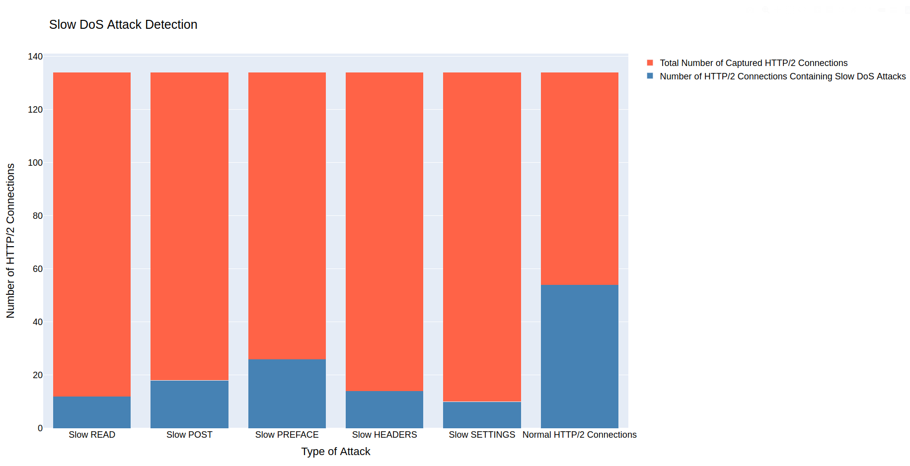

# SLOWHTTP2DETECT
Detection of HTTP/2 Slow DoS Attacks 
This program serves as Slow DoS Attacks detector. Has 2 operational modes: online and offline detection.

## Getting Started

* Download this repo
* Ensure to have created and activated virtual environment

```
python3 -m venv venv        # create virtual environment
source venv/bin/activate    # activate virtual environment
```

* Install necessary packages
```
pip install -r requirements.txt
```
Install this script only on running web server of Linux type.

## Detection Usage
usage:
ONLINE DETECTION MODE:
```
python3 slowhttp2detect.py [-h] [-l] [i interface] [-d duration] 
```

OFFLINE DETECTION MODE:
```
python3 slowhttp2detect.py [-h] [-f file] [-a address]
```

```
optional arguments:
  -h, --help                            show this help message and exit
  -l, --live                            live Slow DoS Attack detection
  -i INTERFACE, --interface INTERFACE   name of interface for Slow DoS Attack live capture
  -d DURATION, --duration DURATION      duration of detection in seconds
  -f FILE, --file FILE                  .pcap file for Slow DoS Attack detection
  -a ADDRESS, --address ADDRESS         ip address of server for Slow DoS Attack detection
```


### Example

Detecting Slow DoS Attack generated with [**SLOWHTTP2TEST**](https://github.com/Michael-Jurek/slowhttp2detect) with following setup:

Malicious connections:
```
python3 slowhttp2test.py 10.0.0.2 read -c 12
python3 slowhttp2test.py 10.0.0.2 post -c 18
python3 slowhttp2test.py 10.0.0.2 preface -c 8
python3 slowhttp2test.py 10.0.0.2 headers -c 14
python3 slowhttp2test.py 10.0.0.2 settings -c 10
```
Alongside valid HTTP/2 connection (every 1 s):
```
$ while true; do curl --http2 http://10.0.0.2; sleep 1; done
```

Online attack detection on interface **eth0** of web server for 20 seconds:
```
python3 slowhttp2detect.py -l -i eth0 -d 20
```

Generated graph in file 'slowhttp2detect.html':




## Author

* **Michael Jurek** - *Initial work, practical part of bachelor thesis*

## License

This project is licensed under the MIT License - see the [LICENSE](LICENSE) file for details
